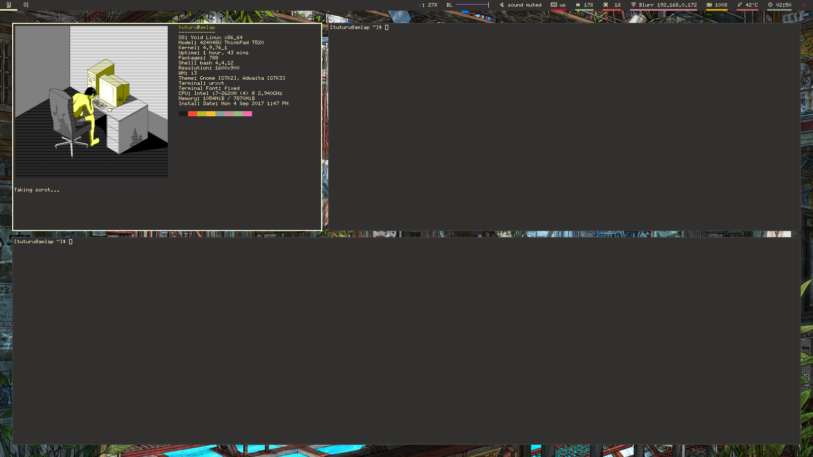

# polybar and i3 configs

# i3-i3-gaps
## lock.sh
A means to lock the i3 desktop that is called by the config file. The script takes a picture of the screen and blurs it, and **i3lock** uses it as the background. In the config file, the user can use **$mod+Shift+p** to exec the script, as well as using **xautolock** to lock the screen after **15 minutes**.
## polybar.sh
A means to use **polybar** except **i3bar**.# polybar
Basically, the same thing as the example polybar config. Only differences are the **korean numerated windows**, the **local ip address** after the wifi name, and a change of colors to better match my urxvt and emacs color scheme.